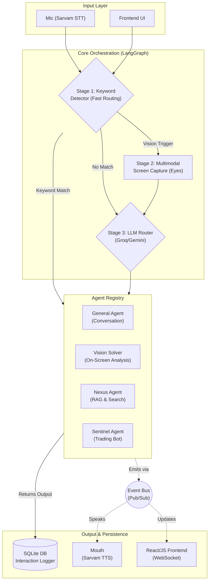

# J.A.R.V.I.S. (Just A Rather Very Intelligent System)


**J.A.R.V.I.S.** is an autonomous, multimodal, event-driven AI assistant inspired by the MCU. It features highly natural Indian-accent voice interaction, computer vision capabilities, and a dynamic LLM-based agent routing system.

Built as a highly modular, production-grade AI pipeline, JARVIS serves as the central orchestration brain capable of seamlessly routing queries to specialized internal agents.

---

## 📸 Architecture Overview

JARVIS uses a three-stage intelligent pipeline (Keyword Detection ➔ Multimodal Vision ➔ LLM Router ➔ Agent Execution), fully decoupled via an **EventBus** architecture.



---

## 🚀 Key Features

* **Event-Driven Architecture**: Fully decoupled system via a Pub/Sub `EventBus`. Components communicate asynchronously without circular dependencies.
* **Flawless Indian-Accent Voice (Sarvam AI)**: 
  * **Ears (STT)**: Powered by `saaras:v4` to flawlessly understand Hinglish and Indian accents.
  * **Mouth (TTS)**: Powered by `bulbul:v3` for studio-quality, highly natural native speech playback.
* **Cinematic Frontend UI (MARK VII)**: Features live telemetry, WebSocket auto-reconnect logic, agent "Title Card" routing animations, and query history scrolling.
* **Multimodal Vision (Eyes)**: Can instantly capture the primary monitor and solve on-screen coding bugs, read text, or analyze UI diagrams.
* **Smart LLM Routing**: Dynamically decides whether to handle a query via standard conversation, screen analysis, or delegate it to a specialized microservice (like the Nexus RAG pipeline).
* **Automated SQLite Auditing**: Every interaction, routing decision, and latency metric is permanently logged to a local SQLite database (`jarvis_memory.db`).
* **Test-Driven AI (Evals)**: Includes a comprehensive 14-test `pytest` suite ensuring 100% LLM routing accuracy, DB integrity, and pipeline validation.

---

## 🛠️ Detailed Tech Stack

| Component | Technology | Purpose & Implementation |
|-----------|-----------|--------------------------|
| **Core Orchestration** | **LangGraph** | Manages the deterministic `StateGraph` flow of the pipeline. |
| **Agent LLM** | **Google Gemini / Groq** | `langchain-google-genai` and `langchain-groq` for intelligent agent reasoning. |
| **Speech-to-Text (STT)** | **Sarvam AI (`saaras:v4`)** | Transcribes raw mic `AudioData` bytes via temporary WAV buffers. |
| **Text-to-Speech (TTS)** | **Sarvam AI (`bulbul:v3`)** | Decodes base64 audio and plays it natively via Windows `winsound.PlaySound`. |
| **Computer Vision** | **`mss` + Gemini 2.5** | Takes rapid screenshots and converts pixels into structured textual descriptions. |
| **Database** | **SQLite3** | Lightweight, zero-config memory layer that tracks latency, inputs, and agents. |
| **Event Bus** | **Custom Python Pub/Sub** | Decouples the FastAPI server from the LangGraph agents for isolated testing. |
| **Testing & Evals** | **Pytest** | 14 automated unit tests evaluating routing logic, DB integrity, and agent schemas. |
| **API & WebSockets** | **FastAPI + Uvicorn** | Real-time bidirectional streaming between the Python backend and JS frontend. |

---

## 📂 Project Structure

```text
J.A.R.V.I.S/
├── agents/             # The plugin directory for autonomous agents
│   ├── _base.py        # The contract all agents must inherit
│   ├── agent_registry  # Auto-discovers & loads agents at runtime
│   ├── general.py      # Conversational LLM agent
│   ├── vision_solver.py# On-screen contextual solver
│   └── nexus_agent.py  # Hybrid RAG & Web Search orchestrator
│
├── core/               
│   ├── brain.py        # The LangGraph StateMachine orchestrator
│   ├── db.py           # SQLite interaction logger
│   ├── events.py       # Central EventBus (Pub/Sub)
│   ├── keyword_detector# Fast 0-cost Regex/Keyword router
│   └── router.py       # LangChain LLM Router
│
├── io_layer/           
│   ├── ears.py         # Sarvam STT integration
│   ├── eyes.py         # MSS Screen capture
│   ├── mouth.py        # Sarvam TTS integration
│   └── hud.py          # Terminal/CLI heads-up display
│
├── tests/              # 14 Pytest suites for testing all nodes & evals
├── ui/                 # HTML/JS/CSS Frontend (Glassmorphism design)
├── main.py             # Entry point (Threads: Audio Loop + Uvicorn Server)
└── jarvis_memory.db    # Production SQLite database
```

---

## ⚙️ Setup & Installation

**1. Clone and Install Dependencies:**
```bash
pip install -r requirement.txt
pip install pytest pytest-asyncio  # For running the test suite
```

**2. Configure Environment Variables:**
Create a `.env` file in the root directory:
```env
GOOGLE_API_KEY=your_gemini_api_key
GROQ_API_KEY=your_groq_api_key
SARVAM_API_KEY=your_sarvam_api_key
```

**3. Run the Application:**
```bash
python main.py
```
> **Access the MARK VII UI at:** `http://localhost:8000/static/index.html`

**4. Run the Evaluation Test Suite:**
```bash
python -m pytest -v tests/
```

---

## 🧠 The Agent Contract (Extensibility)

Adding a new agent is as simple as dropping a Python file into the `/agents/` directory. The `AgentRegistry` dynamically discovers the agent, extracts its `.description`, and seamlessly injects it into the LLM Router's manifest.

```python
from agents._base import BaseAgent, AgentInput, AgentOutput

class CustomAgent(BaseAgent):
    name = "custom_agent"
    description = "Use this agent for specialized tasks..."
    triggers = ["run custom task"]

    def run(self, input: AgentInput) -> AgentOutput:
        return AgentOutput(result="Task Complete", confidence=1.0, source=self.name)
```

---
*Built as a highly modular, decoupled, and test-driven AI product.*
