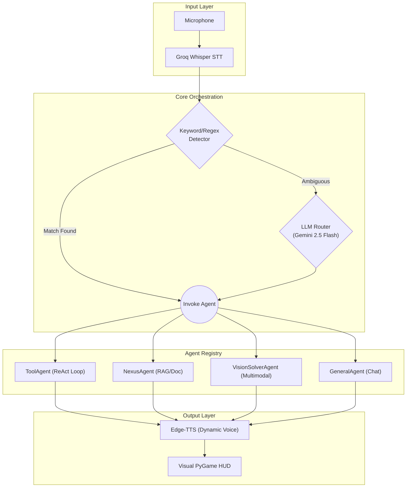

# J.A.R.V.I.S. (Agentic Voice Assistant)


**J.A.R.V.I.S.** is an autonomous, multimodal, event-driven AI assistant. It features an ultra-low latency voice-first interface (Groq Whisper + Edge-TTS), multilingual intent routing, ReAct tool-calling loops, and a fully automated LLM-as-a-judge benchmarking pipeline.

Designed and built as a highly modular pipeline, JARVIS demonstrates core applied AI engineering principles: Semantic Routing, Multi-Agent Collaboration, Fallback mechanisms, and rigorous Evaluation.

---

## 🚀 Key Features

1. **Multi-Agent Architecture**
   - **`ToolAgent`**: Executes Python functions in a continuous ReAct loop (reason & act). Equipped to fetch weather, calculate math, and act as an AI Tutor.
   - **`NexusAgent`**: A RAG-based researcher. It dynamically fetches Wikipedia articles, embeds them using `sentence-transformers`, parses imagery, and writes cinematic documentary scripts.
   - **`VisionSolverAgent`**: Handles on-screen multimodal problems. Parses the screen capture (via `mss`) and intelligently solves visual math, debugs code errors, or describes what the user is pointing at.
   - **`GeneralAgent`**: Handles conversational empathy, philosophy, and unclassified queries with a distinct personality.
2. **Semantic & LLM Routing**
   - Implements a fast-path **KeywordDetector** for low-latency dispatch.
   - Falls back to an intelligent **LLMRouter** (powered by Gemini) for complex, ambiguous query classification.
3. **Multilingual Voice Capabilities (Hindi/English)**
   - Automatically detects user language (e.g., *Hinglish* or Devanagari).
   - Dynamically swaps TTS voices (`en-IN-PrabhatNeural` vs `hi-IN-SwaraNeural`) to respond seamlessly in the correct language with an Indian accent.
4. **Automated Evals & Benchmarking (LLM-as-a-Judge)**
   - A fully isolated, headless test suite (`tests/run_evals.py`) to prevent "vibe-driven development".
   - 20-question Golden Dataset stress-testing logic, language constraints, and ReAct loops.
   - Includes a **Streamlit Web Dashboard** to visualize latency, routing accuracy, and qualitative Judge scores.

---

## 🧠 System Architecture

JARVIS is built using **LangGraph** to manage state across the execution pipeline.



---

## 🛠 Setup & Installation

### 1. Clone the repository
```bash
git clone https://github.com/NeuroMachina01/J.A.R.V.I.S..git
cd J.A.R.V.I.S
```

### 2. Install Dependencies
```bash
pip install -r requirements.txt
```

### 3. Environment Variables
Copy the template and add your API keys:
```bash
cp .env.example .env
```
Ensure you have added your `GOOGLE_API_KEY` (Gemini) and `GROQ_API_KEY` (Whisper/Fallback LLMs).

---

## 💻 Usage

### Starting the Assistant
To run JARVIS interactively (starts the microphone listener and Visual HUD):
```bash
python main.py
```

### Running the Evals Dashboard
To execute the automated evaluation pipeline and visualize the results:

1. **Run the headless benchmarking suite**:
   ```bash
   python tests/run_evals.py > tests/eval_output.log
   ```
2. **Launch the Streamlit Dashboard**:
   ```bash
   streamlit run dashboard.py
   ```
3. Open `http://localhost:8501` in your browser to view the LLM-as-a-judge visualizations.

---

## 📝 Development Notes
- **Fallback Chains**: The system binds tools to `gemini-2.5-flash` but automatically implements a `.with_fallbacks([ChatGroq(...)])` chain in case of `429 RESOURCE_EXHAUSTED` errors on free tiers.
- **State Management**: The core context window and memory are entirely managed via LangGraph checkpointing (`jarvis_memory.db`), ensuring seamless multi-turn conversations.

---
*Built as a showcase for Applied AI Engineering, focused on Voice-First interactions and autonomous agentic workflows.*
