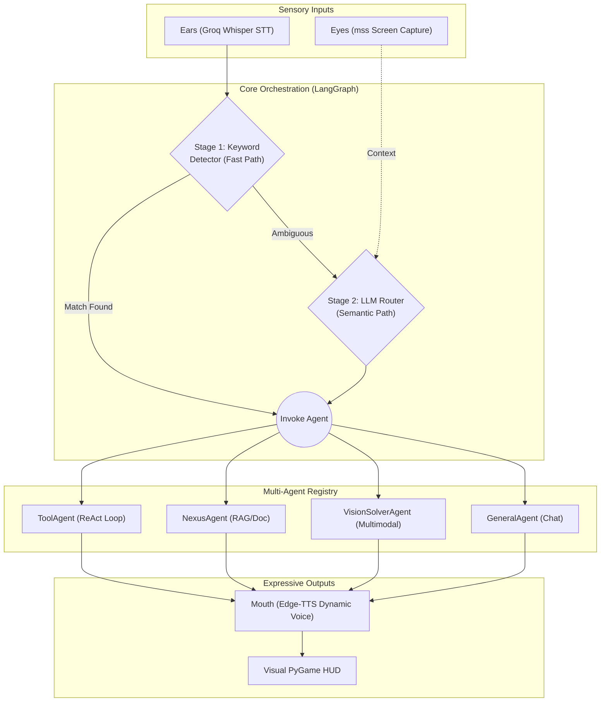

# J.A.R.V.I.S. (Agentic Voice Assistant)


**J.A.R.V.I.S.** is an autonomous, multimodal, event-driven AI assistant operating seamlessly on your local machine. 

## 🌍 The Problem We Are Solving

The current landscape of AI assistants is highly fragmented:
1. **Traditional Voice Assistants** (Siri, Alexa) are fast but rigid. They rely on hardcoded intents and completely lack deep reasoning or dynamic tool usage.
2. **Modern LLM Chatbots** (ChatGPT, Claude) are highly intelligent but are trapped in a text-first, browser-based paradigm. They lack seamless voice integration, screen-awareness, and true multi-agent collaboration.

**J.A.R.V.I.S. bridges this gap.** 
It is designed to be a true "companion" living on your machine. By combining ultra-low latency Speech-to-Text (Groq Whisper), multimodal screen awareness, a dynamic LangGraph routing brain, and ReAct loop tool-calling, JARVIS perceives its environment, reasons through complex multi-step problems, and speaks back to you naturally—all in real-time.

---

## 🧠 System Architecture

JARVIS is orchestrated using **LangGraph**, treating the assistant as a state machine where inputs flow through sensory nodes, get routed to specialized agents, and exit through expressive output layers.



---

## 🔍 Module Deep-Dive

### 1. The Sensory Input Layer
* **`io_layer/ears.py`**: Listens to the user's microphone. Uses `speech_recognition` and dynamically routes the audio buffer to the **Groq Whisper V3** API for lightning-fast, highly accurate transcription. It supports automatic language detection (e.g., identifying Hindi/Hinglish).
* **`io_layer/eyes.py`**: Captures the user's active screen using `mss`. This provides real-time multimodal context without requiring the user to manually upload screenshots.

### 2. The Orchestration Brain (`core/brain.py`)
Acts as the LangGraph state machine orchestrator.
* **`KeywordDetector`**: A zero-latency rule-based router. If the user explicitly asks for "weather" or "calculate", it immediately dispatches the task.
* **`LLMRouter`**: The semantic fallback. If a query is highly ambiguous, a Gemini LLM classifies the intent and intelligently routes the payload to the correct internal agent.

### 3. The Multi-Agent Registry (`agents/`)
Instead of a monolithic prompt, JARVIS distributes tasks to specialized AI "experts":
* **`ToolAgent` (`tool_agent.py`)**: Equipped with Python tools (weather, math, practice questions). Implements a **ReAct (Reason + Act) while-loop**, allowing it to chain multiple tools together (e.g., *fetch the weather, then calculate the temperature into a different unit*).
* **`NexusAgent` (`narrative_agent.py`)**: The deep-research agent. It dynamically scrapes Wikipedia, chunks the text, creates embeddings using `sentence-transformers`, and uses FAISS/BM25 retrieval to write rich, cinematic documentary scripts. It also extracts images from Wikipedia and pushes them to the UI.
* **`VisionSolverAgent` (`vision_solver.py`)**: The multimodal expert. It takes the screen capture provided by the "Eyes" and solves visible math equations, debugs on-screen code errors, or explains visual context.
* **`GeneralAgent` (`general.py`)**: Handles conversational empathy, philosophy, and unclassified queries with a distinct, supportive personality.

### 4. The Expressive Output Layer
* **`io_layer/mouth.py`**: Handles Text-to-Speech using `edge-tts`. It dynamically inspects the Agent's output language flags and swaps voices on the fly (e.g., using `en-IN-PrabhatNeural` for English and `hi-IN-SwaraNeural` for Hindi) to maintain authentic, high-quality Indian accents.
* **`io_layer/hud.py`**: A visually stunning PyGame interface. It displays the AI's internal thought process, subtitles, and dynamically renders images (like historical photos fetched by the NexusAgent).

---

## 🚀 Enterprise Engineering Features

* **LLM Fallback Chains**: Models hit rate limits. JARVIS binds its tools to a primary LLM (`gemini-2.5-flash`), but utilizes LangChain's `.with_fallbacks()` mechanism to automatically route execution to `ChatGroq` if a `429 RESOURCE_EXHAUSTED` error occurs.
* **Automated Benchmarking & Evaluations**: A rigorous, headless evaluation suite (`tests/run_evals.py`). JARVIS bypasses the TTS and PyGame layers to rapidly run a **Golden Dataset** of complex queries through its brain, measuring exact millisecond latency, routing accuracy, and utilizing an **LLM-as-a-Judge** to grade responses 1-to-5.
* **Visual Eval Dashboard**: A built-in Streamlit web application (`dashboard.py`) to parse evaluation logs and generate beautiful pie charts and latency bar graphs to monitor system health over time.

---

## 🛠 Setup & Installation

### 1. Clone the repository
```bash
git clone https://github.com/NeuroMachina01/J.A.R.V.I.S..git
cd J.A.R.V.I.S
```

### 2. Install Dependencies
```bash
pip install -r requirements.txt
```

### 3. Environment Variables
Copy the template and add your API keys:
```bash
cp .env.example .env
```
Ensure you have added your `GOOGLE_API_KEY` (Gemini) and `GROQ_API_KEY` (Whisper/Fallback LLMs).

---

## 💻 Usage

### 🎙️ Starting the Assistant (Interactive Mode)
To launch JARVIS with the microphone listener and Visual HUD:
```bash
python main.py
```

### 📊 Running the Evaluations Dashboard
To execute the automated evaluation pipeline and visualize the results:

1. **Run the headless benchmarking suite**:
   ```bash
   python tests/run_evals.py > tests/eval_output.log
   ```
2. **Launch the Streamlit Dashboard**:
   ```bash
   streamlit run dashboard.py
   ```
3. Open `http://localhost:8501` in your browser to view the LLM-as-a-judge visualizations.
